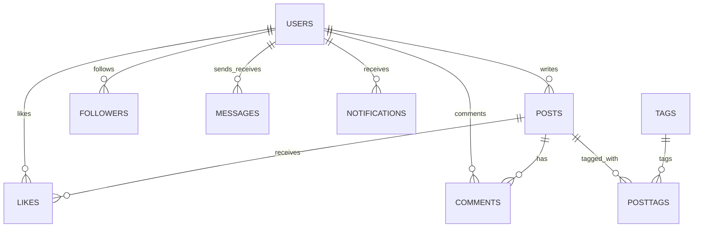

# Social Media Users Database Management System (SocialDB)

A comprehensive Database Management System (DBMS) lab project built to simulate and manage the core relational database structure of a modern social media platform. The project includes a complete relational database schema and a functional full-stack dashboard (Node.js/Express + MySQL + Vanilla HTML/CSS/JS) to interact with user and post records.

---

## 📌 Project Overview
The goal of this project is to model and implement the backend database logic for a social media application. The system supports user accounts, posts, followers/following dynamics, likes, comments, private messaging, notifications, and hashtags (tags).

It demonstrates advanced relational database management system features including:
- **Constraints & Referentials**: Primary keys, Foreign keys, Auto-increment, Defaults, Unique indexes, and Check constraints.
- **Advanced SQL Queries**: Inner joins, group-by aggregation, having filters, subqueries, and Common Table Expressions (CTEs).
- **Stored Procedures**: Reusable business logic (e.g., adding posts) and looping constructs.
- **User-Defined Functions**: Logic to calculate aggregate data (e.g., total posts per user).
- **Triggers**: Automated event-driven actions (e.g., notifying users when a post is created).
- **Database Views**: Predefined virtual tables for consolidated feeds.
- **Transaction Control (TCL)**: Safe data execution using transactions and savepoints.
- **Data Control Language (DCL)**: Database administration via users, privileges, grants, and revokes.

---

## 🗄️ Database Schema Design

The project uses a database named `SocialDB` containing 9 relational tables:



### Table Dictionary
1. **`Users`**: Holds demographic and login details (`user_id`, `username`, `email`, `password`, `full_name`, `bio`, `profile_pic`, `created_at`).
2. **`Posts`**: Stores text updates published by users. Linked to `Users` with a foreign key.
3. **`Followers`**: Models the self-referencing many-to-many relationship of users following other users (with a Check constraint ensuring a user cannot follow themselves).
4. **`Likes`**: Records which users liked which posts. Includes a composite unique constraint to prevent duplicate likes.
5. **`Comments`**: Tracks comments left on posts by different users.
6. **`Messages`**: Tracks direct, private message exchanges between a sender and a receiver.
7. **`Notifications`**: Stores system alerts generated for users.
8. **`Tags`**: Stores hashtag strings (`#Tech`, `#AI`, etc.) to categorize posts.
9. **`PostTags`**: Junction table mapping the many-to-many relationship between `Posts` and `Tags`.

---

## 🛠️ Advanced Database Features Implemented

### 1. Database View (`Feed`)
Aggregates user post information for streamlined reading:
```sql
CREATE VIEW Feed AS
SELECT u.username, p.content
FROM Users u 
JOIN Posts p ON u.user_id = p.user_id;
```

### 2. Stored Procedures & Loops
- **Looping Demo**: A procedure (`while_loop_demo`) that runs a `WHILE` loop to insert dummy notifications into the database.
- **Business Procedure**: `AddPost(IN uid INT, IN msg TEXT)` inserts a new post directly.

### 3. User-Defined Functions
`TotalPosts(uid INT)` returns the count of posts written by a specific user:
```sql
SELECT TotalPosts(1); -- Returns post count for User 1
```

### 4. Database Trigger
`after_insert_post` automatically inserts a record into the `Notifications` table whenever a new post is created in `Posts`.

### 5. Transactions (TCL)
Demonstrates database reliability and atomicity using:
```sql
START TRANSACTION;
UPDATE Users SET bio='Updated';
SAVEPOINT sp1;
ROLLBACK TO sp1;
COMMIT;
```

### 6. User Security (DCL)
Secures the database by creating a user and specifying operational privileges:
```sql
CREATE USER 'admin'@'localhost' IDENTIFIED BY 'pass';
GRANT ALL PRIVILEGES ON SocialDB.* TO 'admin'@'localhost';
REVOKE INSERT ON SocialDB.* FROM 'admin'@'localhost';
```

---

## 💻 Tech Stack & Project Architecture

- **Database**: MySQL / MariaDB
- **Backend API**: Node.js + Express + `mysql` package (handles CORS and JSON payloads)
- **Frontend Dashboard**: HTML5, Vanilla JavaScript, and CSS Grid layout for interactive database management.

---

## 🚀 Setup & Execution Instructions

### Prerequisites
- **Node.js** (v14 or higher) installed on your system.
- **MySQL / XAMPP / WampServer** installed and running on your system.

### Step 1: Import the SQL Schema
1. Open your MySQL client (e.g., phpMyAdmin, MySQL Workbench, or CLI).
2. Create and select the database:
   ```sql
   CREATE DATABASE SocialDB;
   USE SocialDB;
   ```
3. Run the SQL script from `schema.sql` to generate the tables, procedures, triggers, views, and insert the seed data.

### Step 2: Configure and Start the Backend
1. Navigate to the project root directory:
   ```bash
   cd social-media-project
   ```
2. Install the Node dependencies:
   ```bash
   npm install
   ```
3. Verify your database connection settings in `server.js` (lines 10-15):
   ```javascript
   const db = mysql.createConnection({
       host: "localhost",
       user: "root",       // Your MySQL username
       password: "",       // Your MySQL password
       database: "SocialDB"
   });
   ```
4. Start the Express server:
   ```bash
   node server.js
   ```
   *The console should print: `Server running on port 3000` and `MySQL Connected`.*

### Step 3: Run the Frontend Dashboard
1. Open the `index.html` file directly in any modern browser.
2. Use the dashboard UI to:
   - **View Users**: Fetched dynamically from MySQL.
   - **Add User**: Create new user profiles in the database.
   - **Delete User**: Delete user accounts.
   - **Add Post**: Enter content and bind it to a user ID.
   - **Delete Post**: Clean up posts dynamically.
